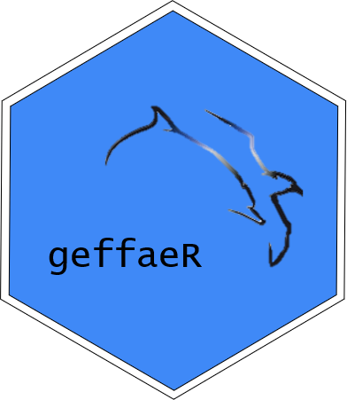
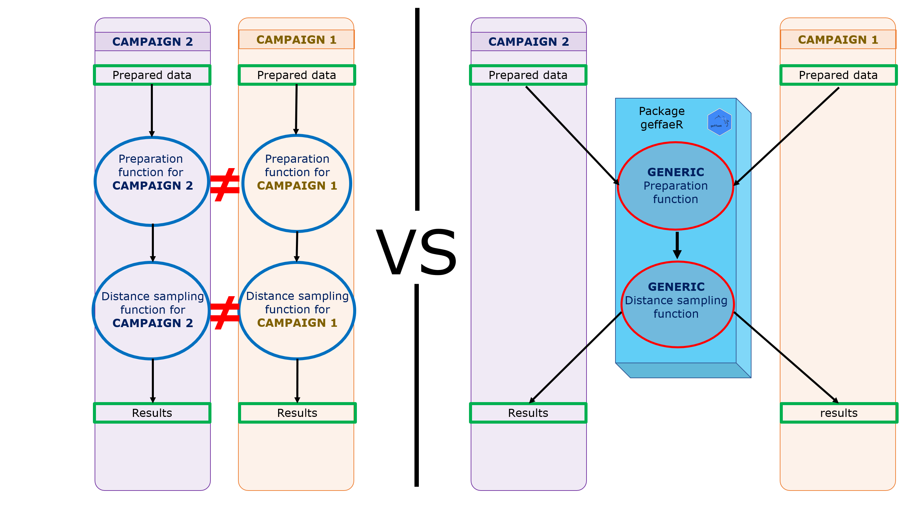

```{r setup, include=FALSE}
knitr::opts_chunk$set(echo = TRUE)
```

```{r, include = FALSE}
knitr::opts_chunk$set(
  fig.path = "man/figures/"
)
```

# geffaeR 

Distance sampling is a methodology used to estimate abundance/density of animal species from transect sampling. Abundance and density estimation can be realised with tools such as cds, kriging, density surface modelling. But from a campaign to another, the objectives are not always the same, while the method remains the same. So geffaeR aims at simplifying the process of analyzing observation campaign and avoid to have to rewrite functions and script to adapt for each study case.

To illustrate geffaeR interest we can consider an example. For a particular campaign, we want a cds analysis for all the filed trip but for species a and b. For the other campaign we want a cds analysis for each session of the campaign for species b and c. So there are specificities that will be managed by the user but the method can be set to be generic and put in a package, so we don't have to modify the method for every campaign (illustrated fig1).

```{r, fig.cap = "fig1 : Analysis process of observation campaign before and after the creation of geffaeR", echo = F, fig.retina = 3, out.width = '75%'}

```


This package proposes functions to manipulate observation campaign for the estimation of abondance indexes by using several tools for different type of analysis, such as :

* CDS analysis (Coventional Distance Sampling) using Distance package ([Distance](https://CRAN.R-project.org/package=Distance))
* Kriging
* CDS analysis using Stan ([rstan](https://CRAN.R-project.org/package=rstan))
* DSM (Density Surface Modelling) using dsm package ([dsm](https://CRAN.R-project.org/package=dsm))
<br>
<br>
