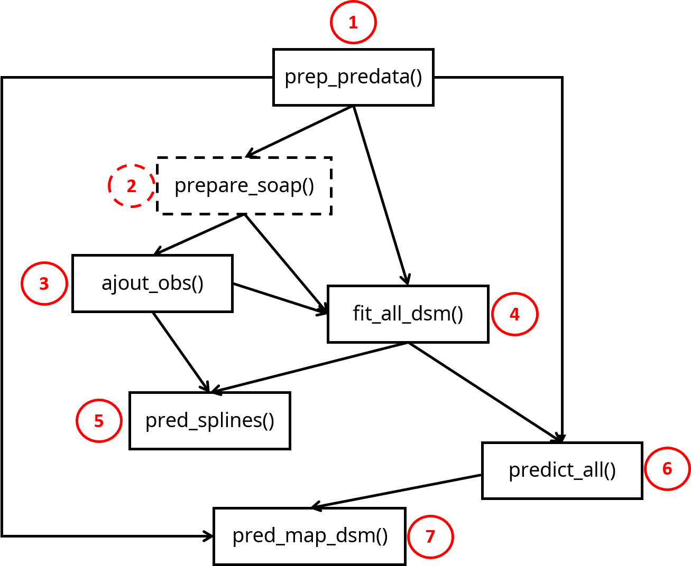

```{r setup, include = FALSE}
knitr::opts_chunk$set(
  collapse = TRUE,
  comment = "#>"
)
library(mathUtil)
```

Density Surface Model (DSM) consist in adjusting gam family model on observation from a bunch of covariates associated with. Once a model is adjusted it can predict the response variable where no observation occured as far as there are covariates available.
geffaeR uses [DSM](https://github.com/DistanceDevelopment/dsm) package which gives a clear explanation on the use of Density Surface Model.
In this vignette it is presented how to perform DSM with geffaeR and what is needed to do it applied on an example.

Plan of the vignette :

1. Data presentation
2. DSM with geffaeR


# 1.Data presentation

To illustrate how to use DSM in geffaeR, it is proposed to use the **DSM_pack_MOLMOL** include in geffaeR data. It consist in a list of list bringing together all files needed for a DSM analysis.
```{r str DSM_pack_MOLMOL, echo=F, warning=FALSE}
suppressPackageStartupMessages(library(geffaeR))
str(DSM_pack_MOLMOL[[1]], max.level = 1)
str(DSM_pack_MOLMOL[[2]], max.level = 3)
str(DSM_pack_MOLMOL[[3]], max.level = 2)
str(DSM_pack_MOLMOL[[4]], max.level = 2)
str(DSM_pack_MOLMOL[[5]], max.level = 1)
```


## What ?

_Mola mola_ known as Sunfish is a marine species that can reach 1ton ! It can live in temperate and tropical waters. It have a particular shape that makes it easy to recognize :

```{r molamola image, echo = F, out.width='250px'}

```

## How ?
The data were collected during the SAMM campaign. This campaign consist in flying over the sea and count all observation of marine mammals and Seabirds mainly according to a particular transect. Part of the campaign occured in the Mediterranean sea.

```{r global view, echo=F, warning = F}
suppressPackageStartupMessages(library(sf))
suppressPackageStartupMessages(library(tidyverse))
suppressPackageStartupMessages(library(ggplot2))

distdata <- DSM_pack_MOLMOL$list_prepare_obs_MOLMOL$MOLMOL_obs_output$distdata

distdata_detected <- distdata %>% 
  filter(detected == 1)

ggplot() +
  geom_sf(data = NEA_simplified_FR %>% st_as_sf(), mapping = aes()) +
  geom_rect(aes(xmin = 2, xmax = 12, ymin = 40, ymax = 45), fill = alpha("white",0), colour = "black", size = 2) +
  theme_light() +
  ggtitle("Global view of the study area") +
  theme(plot.margin =  margin(0, 0, 0, 0, "cm"))
```


```{r map observation effort, echo=F, out.width="50%"}
segdata <- DSM_pack_MOLMOL$effort_output$segdata

ggplot() +
  geom_sf(data = NEA_simplified_FR %>% st_as_sf(), mapping = aes()) +
  coord_sf(xlim = c(2,12), ylim = c(40,45)) +
  geom_point(data = segdata, aes(x = longitude, y = latitude), colour = alpha("black",0.5)) +
  theme_light() +
  ggtitle("Sampling effort in SAMM campaign \nin the mediterranean sea") +
  theme(plot.margin =  margin(0, 0, 0, 0, "cm"))

ggplot() +
  geom_sf(data = NEA_simplified_FR %>% st_as_sf(), mapping = aes()) +
  coord_sf(xlim = c(2,12), ylim = c(40,45)) +
  geom_point(data = distdata_detected, aes(x = longitude, y = latitude), colour = alpha("black",0.5)) +
  theme_light() +
  ggtitle("Observation of MOLMOL in SAMM \ncampaign in the mediterranean sea") +
  theme(plot.margin =  margin(0, 0, 0, 0, "cm"))
```

## When ?
```{r SAMM calendar, include = F}

library(extrafont)
library(mathUtil)
library(lubridate)
library(dplyr)
library(cowplot)
library(ggpubr)


occ_effort <-  segdata %>% 
  group_by(date, session) %>% 
  summarize(n=n()) %>% 
  select(!n)


theme_set(
  theme_bw() +
    theme(
      axis.text = element_text(size = 14),
      axis.title = element_text(size = 14),
      strip.text.y = element_text(size = 15),
      legend.text=element_text(size=12),
      legend.title = element_text(size = 12)
    )
)

empty_calendar <- tibble(
  DateCol = c(
    seq(dmy("01/01/2011"),dmy("31/12/2012"), "days")
  )
)

empty_calendar <- empty_calendar %>% 
  mutate(weekday = wday(DateCol, label = T, week_start = 1, locale = "English_United States.1252"), # can put week_start = 1 to start week on Monday
         month = month(DateCol, label = T, locale = "English_United States.1252"),
         date = yday(DateCol),
         week = isoweek(DateCol),
         year = year(DateCol)
  )


# isoweek makes the last week of the year as week 1, so need to change that to week 53 for the plot
empty_calendar$week[empty_calendar$month=="Dec" & empty_calendar$week==1] = 53 

empty_calendar <- empty_calendar %>% 
  group_by(month) %>% 
  mutate(monthweek = 1 + week - min(week)) %>% 
  as_tibble()


# empty_calendar %>% 
#   filter(monthweek == 52) %>% 
#   unique(year, month) %>% 
#   mutate(monthweek = ifelse(monthweek == 52, 1 + week - min(week))
# 

# join occ with empty calendar
occ_calendar_tot <- empty_calendar %>% 
  left_join(occ_effort, by = c("DateCol"="date")) %>% 
  rename(dateCol = DateCol)

occ_calendar_tot$valueCol <- as_factor(occ_calendar_tot$session)
occ_calendar_tot$year <- as.factor(occ_calendar_tot$year)


# subsetting function
subsetting <- function(df, subset, var){
  df <- df %>% 
    filter(!!sym(var) == !!subset)
  return(df)
}

unique_year <- unique(occ_calendar_tot$year)[1:2]

# g_calendar depending on year
g_cal <- lapply(unique_year,
               subsetting,
               var = "year",
               df = occ_calendar_tot) %>% 
  map(g_calendar) %>% 
  map2(.f = function(x, title){x <- x + ggtitle(title)}, .y = unique_year)

# common legend (fake plot to get legend)
com_legend <- get_legend(
  ggplot(occ_calendar_tot %>%
           filter(!is.na(session))) +
    geom_bar(stat = "identity", aes(x=weekday, y=date, fill = session)) 
    # scale_fill_manual(values = irisColors)
)

# plot the 2 years
ggarrange(plotlist = g_cal, common.legend = T, nrow = 2, legend.grob = com_legend, legend = "right")
# ggarrange(plotlist = g_cal)

```


The data sampling occured on 4 different years but for MOLA MOLA there are only available for 2 years : `r sort(unique(lubridate::year(segdata$date)))`. 


# 2. DSM 

To make the simpliest DSM with geffaeR, only 4 objects are necessary :

* segdata (output of `prepare_effort()`)
* gridata (sf object)
* shape (shape of the study area)
* observation (countdata_leg and contdata_seg outputs of `prepare_obs()`)
* esw / distFit : output of `plot_detection()`

6 functions of geffaeR are used in the DSM process (and 1 optional for soap smooth, dashed in the next figure) :

```{r, echo = F, out.width="50%", fig.align="center"}

```

## 2.1 Simple DSM with geffaeR

### Prepare predata and segdata for DSM

This step consist in imputing missing values of covariates of segdata and gridata.
```{r}
library(geffaeR)

# get segdata
segdata <- DSM_pack_MOLMOL$effort_output$segdata

# get grid
grid <- DSM_pack_MOLMOL$gridata  

# get shape 
shape <- DSM_pack_MOLMOL$shape_med

predata_output <- prep_predata(segdata = segdata,
                               gridfile_name = grid,
                               varenviro = c("depth","distCot"),
                               do_log_enviro = c("depth","distCot"),
                               varphysio = "CHL_month",
                               do_log_physio = "CHL_month",
                               imputation = "Amelia",
                               shape = shape,
                               verbose = F
                               )


```


What is inside predata_output :

```{r}
str(predata_output, max.level = 1)
```

* predata : gridata with only covariates, coordinates and cells size (Area column) 
* segdata : segdata 
* pca_seg : output of PCA function on segdata (eig, coord on axis, ...)
* pca_pred : output of PCA function on predata (gridata) (eig, coord on axis, ...)
* seg_mipat : extended infos on missing values of covariates in segdata
* pred_mipat : extended infos on missing values of covariates in predata

### Add observations on segdata

```{r}
effort_w_obs <- ajout_obs(countdata_leg = DSM_pack_MOLMOL$list_prepare_obs_MOLMOL$MOLMOL_obs_output$countdata_leg,
                          legdata = DSM_pack_MOLMOL$effort_output$legdata,
                          countdata_seg = DSM_pack_MOLMOL$list_prepare_obs_MOLMOL$MOLMOL_obs_output$countdata_seg,
                          segdata = predata_output$segdata)

str(effort_w_obs, max.level = 2)
```

segdata in effort_w_obs has 2 columns added "n" corresponding to the number of observation and "y" corresponding to the number of individuals counted.


### Fit all possible model
 
The next step consist in fitting all possible models and choose the best model to use for DSM with `fit_all_dsm` function. 
The minimum required to use this function are :

* segdata completed (output of `prep_predata`) and with observation (outputof `ajout_obs`).
* distFit or esw (outputs of `plot_detection`)
* obsdata
* predictors : covariates of segdata which will be uesd to fit gam models.

```{r}
# get segdata_completed_w_obs
segdata_completed_w_obs <- effort_w_obs$segdata_obs

# get distFit
distFit <- DSM_pack_MOLMOL$list_plot_detection_MOLMOL$plot_detectionMOLMOL$all_session$distFit

# get obsdata
obsdata <- DSM_pack_MOLMOL$list_prepare_obs_MOLMOL$MOLMOL_obs_output$obsdata

# get covariates on which we fit gam model (predictors)
predictors <- c("CHL_month","distCot","depth")

# fit models
fit_dsm <- fit_all_dsm(distFit = distFit,
                       segdata_obs = segdata_completed_w_obs,
                       obsdata = obsdata,
                       predictors = predictors)

```

fit_all_dsm gives in output a table that sum up model fitting according to different indicators and 2 list of the k best models (5 by default) sorted by their "stacking_weights". Both lists are the same but one has standardized  covariates (best_models) and the other has the raw values (best_models4plotting).

```{r, echo = F}
library(kableExtra)
fit_dsm$all_fits_binded %>% 
  kable("html") %>%
  kable_styling(font_size = 12)
```


### visualize splines

One does want to visualize splines of each variable fitted with `fit_all_dsm`, and it is possible with `pred_splines`.

```{r}
# get first model of fit_dsm
fit_dsm_1 <-fit_dsm$best_models4plotting[[1]]

splines <- pred_splines(
  segdata = segdata_completed_w_obs,
  dsm_model = fit_dsm_1
)

str(splines, max.level = 1)

```

<!-- Décrire ce qu'il y a dans les outputs de pred_splines -->
* g_splines : correspond to the ggplot graph that gives splines of each variable of the model.
* df_splines : data.frame 
* 


```{r}
# Visualize variable splines
splines$g_splines
```


### Predict all models of fit_all_dsm

This step consit in getting predicted values from models fitted with fit_all_dsm. The predicted values are set by the predict function of stats package. 

```{r}
# get predata
predata <- predata_output$predata

predicted_models <- predict_all(
  listdsm = fit_dsm,
  predata = predata
)

str(predicted_models)
```

`predict_all` gives a data.frame of predicted values and standard error of the k best models of `fit_all_dsm` with a weighted combination of the k best named 'stacking' in the model column.


### Prediction map 

`predict_map` allows to visualize prediction of `predict_all`.

```{r}
# get combination of all models  
pred_stack <- predicted_models %>% 
  filter(model == "stacking") 


# Set predata as sf object 
predata_custom <- predata %>% 
  mutate(stack_pred = pred_stack$mean) %>%
  st_as_sf(coords = c("longitude", "latitude"), crs = 4326)  

  
# Build prediction map
map_pred <- pred_map_dsm(
  predata = predata_custom,
  grid = DSM_pack_MOLMOL$gridata %>%
    st_transform("+proj=aea +lat_1=43 +lat_2=62 +lat_0=30 +lon_0=10 +x_0=0 +y_0=0 +ellps=intl +units=m +no_defs"),
  var = "stack_pred",
  title = substitute(expr = paste("Density prediction of ", italic("Mola mola"), " for 2011 and 2012 during SAMM campaign"))
  # title = "Density prediction of Mola mola for 2011 and 2012 during SAMM campaign"
)

map_pred

```


## 2.2 Adding a categorical variable

The sampling occured during 2 seasons (summer and winter) and we can suggest a different number of Mola mola between summer and winter. Then it would be interesting to model *Mola mola* density according to the session variable.

```{r}
library(stringr)

# get distdata
distdata <- DSM_pack_MOLMOL$list_prepare_obs_MOLMOL$MOLMOL_obs_output$distdata

# map of Mola mola occurence per season
distdata %>% 
  filter(detected != 0) %>% 
  mutate(session = stringr::str_extract(session, "[:alpha:]+")) %>% 
  ggplot() +
  geom_point(aes(x = X, y = Y, size = size, colour = size)) +
  geom_sf(data = NEA_simplified_FR %>% st_as_sf(), mapping = aes()) +
  coord_sf(xlim = c(2,12), ylim = c(40,45)) +
  facet_grid(.~session) +
  scale_colour_viridis_c() +
  theme_bw()
   
```

What has to be added to a simple DSM process ?

* `prep_predata` xith col2keep = "session"
* `fit_all_dsm` with splines_by = "session"
* `pred_splines` with splines_by = "session"
* `pred_map_dsm` with facet_param = "session"


```{r}
library(geffaeR)
library(tidyverse)

# get segdata
segdata <- DSM_pack_MOLMOL$effort_output$segdata %>% 
  mutate(session = fct_drop(session))


# get grid
grid <- DSM_pack_MOLMOL$gridata %>% 
  rename(session = session_) %>% 
  mutate(session = fct_drop(session))

# get shape 
shape <- DSM_pack_MOLMOL$shape_med

# build predata outputs
predata_output <- prep_predata(segdata = segdata,
                               gridfile_name = grid,
                               varenviro = c("depth","distCot"),
                               do_log_enviro = c("depth","distCot"),
                               varphysio = "CHL_month",
                               do_log_physio = "CHL_month",
                               shape = shape,
                               imputation = "PCA",
                               col2keep = "session",
                               verbose = F
                               )

effort_w_obs <- ajout_obs(countdata_leg = DSM_pack_MOLMOL$list_prepare_obs_MOLMOL$MOLMOL_obs_output$countdata_leg,
                          legdata = DSM_pack_MOLMOL$effort_output$legdata,
                          countdata_seg = DSM_pack_MOLMOL$list_prepare_obs_MOLMOL$MOLMOL_obs_output$countdata_seg,
                          segdata = predata_output$segdata)

# get segdata_completed_w_obs
segdata_completed_w_obs <- effort_w_obs$segdata_obs

# get distFit
distFit <- DSM_pack_MOLMOL$list_plot_detection_MOLMOL$plot_detectionMOLMOL$all_session$distFit

# get obsdata
obsdata <- DSM_pack_MOLMOL$list_prepare_obs_MOLMOL$MOLMOL_obs_output$obsdata

# get covariates on which we fit gam model (predictors)
predictors <- c("CHL_month","distCot","depth")

# fit models
fit_dsm <- fit_all_dsm(distFit = distFit,
                       segdata_obs = segdata_completed_w_obs,
                       obsdata = obsdata,
                       predictors = predictors,
                       splines_by = "session")

# get first model of fit_dsm
fit_dsm_1 <- fit_dsm$best_models4plotting[[1]]

splines <- pred_splines(
  segdata = segdata_completed_w_obs,
  dsm_model = fit_dsm_1,
  splines_by = "session"
)

splines$g_splines

```

```{r}
library(sf)
# get predata
predata <- predata_output$predata

predicted_models <- predict_all(
  listdsm = fit_dsm,
  predata = predata
)


# get combination of all models  
pred_stack <- predicted_models %>% 
  filter(model == "best_1") 


# Set predata as sf object 
predata_custom <- predata %>% 
  mutate(stack_pred = pred_stack$mean) %>%
  st_as_sf(coords = c("longitude", "latitude"), crs = 4326)  

  
# Build prediction map
map_pred <- pred_map_dsm(
  predata = predata_custom,
  grid = DSM_pack_MOLMOL$gridata %>%
    st_transform("+proj=aea +lat_1=43 +lat_2=62 +lat_0=30 +lon_0=10 +x_0=0 +y_0=0 +ellps=intl +units=m +no_defs"),
  var = "stack_pred",
  title = substitute(expr = paste("Density prediction of ", italic("Mola mola"), " for 2011 and 2012 during SAMM campaign")),
  facet_param = "session"
)

map_pred

```

