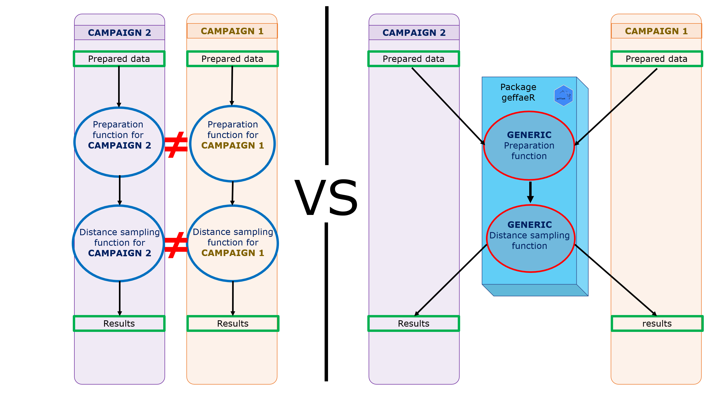

```{r, include = FALSE}
knitr::opts_chunk$set(
  collapse = TRUE,
  comment = "#>"
)
```


## Introduction
When a lot of distance sampling campaign are made, analysis have to be done to estimate abundance with tools such as distance, dsm, kriging. But from a campaign to another, the objectives are not always the same, while the method remains the same.

Ex : For a particular campaign, we want a cds analysis for all the campaign but for species a and b. For the other campaign we want a cds analysis for each session of the campaign for species b and c. So there are specificities that will be managed by the user but the method can be set to be generic and put in a package, so we don't have to modify the method for every campaign (illustrated fig1).

```{r, fig.cap = "fig1 : Analysis of observation campaign before and after the creation of geffaeR", echo = F, fig.retina = 3, out.width = '75%'}

```


This package proposes functions to manipulate observation campaign for the estimation of abondance indexes by using several tools for different type of analysis, such as :

* CDS analysis (Coventional Distance Sampling) using Distance package ([Distance](https://CRAN.R-project.org/package=Distance))
* Kriging
* CDS analysis using Stan ([rstan](https://CRAN.R-project.org/package=rstan))
* DSM (Density Surface Modelling) using dsm package ([dsm](https://CRAN.R-project.org/package=dsm))
<br>
<br>

This vignette presents :

1. Data preparation
2. CDS analysis
3. Kriging


# 1. Data Preparation

Analysis are performed on data collected with [SAMMOA](https://www.codelutin.com/page-detail-sammoa.html) software. This software allows observers to collect data while there are in aircraft or on boat. The outputs of this software are structured as below:

* Observation 
```{r, echo = FALSE, message=FALSE, warning=FALSE}
library(geffaeR)
library(tidyverse)
library(DT)
htmltools::div(
  head(observation_example) %>% 
  datatable(options = list(pageLength = 4, scrollX = T), width = 700),
    style = "font-size:70%"
)
```

* Effort
```{r, echo = FALSE}
library(geffaeR)
library(tidyverse)
library(DT)
htmltools::div(
  head(effort_example) %>% 
  datatable(options = list(pageLength = 4, scrollX = T), width = 700),
    style = "font-size:70%"
)
```
<br>
<br>


## 1.1 change column names

To perform analysis on thoose data, it is necessary to modify its column name to match the need of packages (Distance, dsm). To do so, there are 2 functions ```change_effort_varName()``` and ```change_obs_varName()```.


## 1.2 Prepare data

Then, it is necessary to modify the data structure. Effort and observation are modified to 
```{r}
library(data.tree)
standard_effort <- change_effort_varName(effort_example)
test <- prepare_data_effort(effort_base = standard_effort, 
                    shape = shape_example,
                    optimal = T,
                    block_area = data.frame(Block = c("ATL_N"), 
                                            Area = c(shape_example$area)), 
                    New_projection = lbrt93_proj,
                    covariable = NULL)
tree <- as.Node(effort_example)
print(tree)

```


