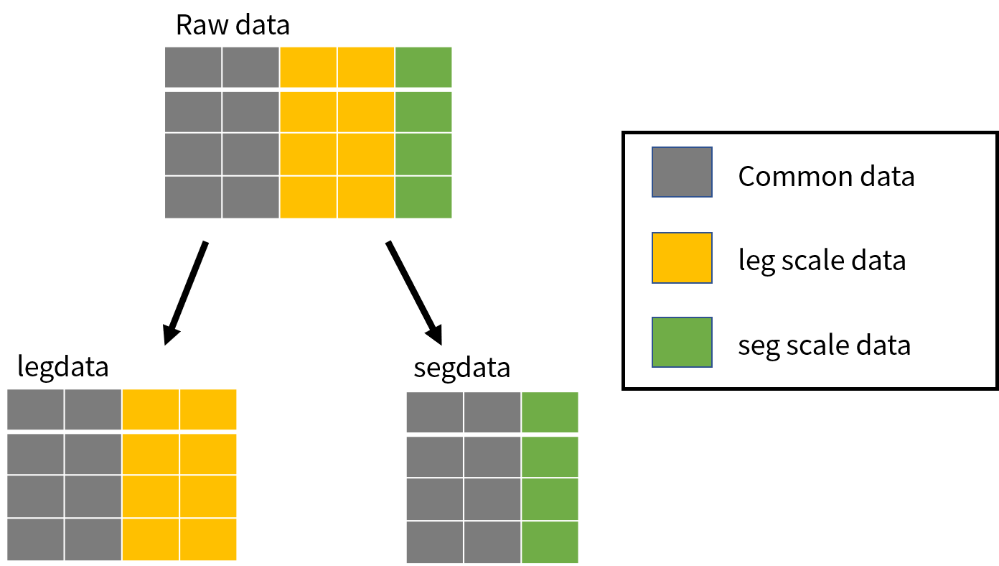

  
```{r, include = FALSE}
knitr::opts_chunk$set(
collapse = TRUE,
comment = "#>"
)
```


This vignette presents :

1. Data preparation
2. CDS analysis
3. Kriging


# 1. Data Preparation

Analysis are performed on data collected with [SAMMOA](https://www.codelutin.com/page-detail-sammoa.html) software. This software allows observers to collect data while there are in aircraft or on boat. The outputs of this software are structured as below:

* Observation 
```{r, echo = FALSE, message=FALSE, warning=FALSE}
library(geffaeR)
library(tidyverse)
library(DT)
htmltools::div(
  observation_example %>% 
    datatable(options = list(pageLength = 5, scrollX = T), width = 700)
)
```

* Effort
```{r, echo = FALSE}
library(geffaeR)
library(tidyverse)
library(DT)
htmltools::div(
  effort_example %>% 
    datatable(options = list(pageLength = 5, scrollX = T), width = 700)
)
```
<br>
<br>


## 1.1 Change column names

To perform analysis on thoose data, it is necessary to modify its column name to match the need of packages (Distance, dsm). To do so, there are 2 functions ```change_effort_varName()``` and ```change_obs_varName()```.


## 1.2 Change data format

Then, it is necessary to modify the data structure in a way to have the proper sub-dataframe for distance function. For this, effort dataframe is devided into 2 sub-dataframes :

* legdata : effort data at leg scale
* segdata :  effort data at segment scale

```{r, echo = F, fig.retina = 3, out.width = '75%', fig.align='center'}

```

```{r}
standard_effort <- change_effort_varName(effort_example)
prepared_effort <- prepare_data_effort(effort_base = standard_effort, 
                                       shape = shape_example,
                                       optimal = T,
                                       block_area = data.frame(Block = c("ATL_N"), 
                                                               Area = c(shape_example$area)), 
                                       New_projection = lbrt93_proj,
                                       covariable = NULL)
str(prepared_effort)

```

Observation dataframe is splitted into 4 sub-dataframes.

```{r}
standard_obs <- change_obs_varName(observation_example)
sp1 <- unique(observation_example$species)[1]
legdata <- prepared_effort$legdata
segdata <- prepared_effort$segdata
projection <- "+proj=longlat +datum=WGS84 +no_defs +ellps=WGS84 +towgs84=0,0,0"

observation_output_TURTRU <- prepare_data_obs(sp = sp1, 
                                              obs_base = standard_obs, 
                                              legdata = legdata, 
                                              segdata = segdata, 
                                              shape = shape_example, 
                                              shape_layer = shape_layer, 
                                              projection = projection)
str(observation_output_TURTRU)
```


# 2. Cds analysis

## 2.1 Case of non seabird 

After preparing and formatting the data, the next step consist in adjusting a detection function on the data with the function ```plot_detection()```. It is possible to choose between a half-normal function or hazard-rate one. It is necessary to inform the distance between which we want to apply the detection function.

```{r}
detection_TURTRU <- plot_detection(distdata = observation_output_TURTRU$distdata,
                                   bin = seq(0.0,1.0, 0.05),
                                   key = "halfnorm",
                                   upper = 1.0)
```

This function as several outputs, it gives : the esw (effective strip width),
```{r}
detection_TURTRU$esw
```

its coefficient of variation (CV),
```{r}
detection_TURTRU$esw_cv
```

the output of distance function from the package [Distance](https://CRAN.R-project.org/package=Distance)
```{r}
detection_TURTRU$distFit
```
```{r}
summary(detection_TURTRU$distFit)
```

and gives the detetction plot, on the graph the red-dashed line correspond to the effective strip width (esw)


```{r TURTRU_plot_detection}
detection_TURTRU$graph
``` 


## 2.2 Case of seabird

For Seabirds a strip-transect is applied, that means there is no distance assigned for seabirds observation, it is set to 0.2km. To apply a detection function, it is necessary to "hack" the method for estimating seabirds abundance. The "hacking" method consist in setting distance of observation as 0 or 0.2km with a sample function. There will be as many 0 as there are 0.2 in the distance column. That means from a distance of 0 to 0.2km all seabirds will be detected. Then the detection function is a uniform function from 0 to 0.2km with a detection probability of 1.

```{r}
sp2 <- unique(observation_example$species)[2]
legdata <- prepared_effort$legdata
segdata <- prepared_effort$segdata
projection <- "+proj=longlat +datum=WGS84 +no_defs +ellps=WGS84 +towgs84=0,0,0"

observation_output_LARMEL <- prepare_data_obs(sp = sp2, 
                                              obs_base = standard_obs, 
                                              legdata = legdata, 
                                              segdata = segdata, 
                                              shape = shape_example, 
                                              shape_layer = shape_layer, 
                                              projection = projection)
temp <- observation_output_LARMEL$distdata
temp$distance <- sample(c(0, 0.2),size = nrow(temp), replace = TRUE) * ifelse(is.na(observation_output_LARMEL$distdata$distance), NA, 1)
fit <- Distance::ds(temp, key = "unif", adjustment = "poly", formula = ~1, truncation = 0.2)
plot(fit)

```


# 3. Kriging

(coming soon)
